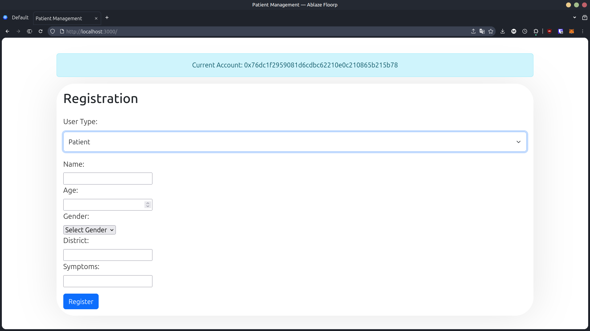
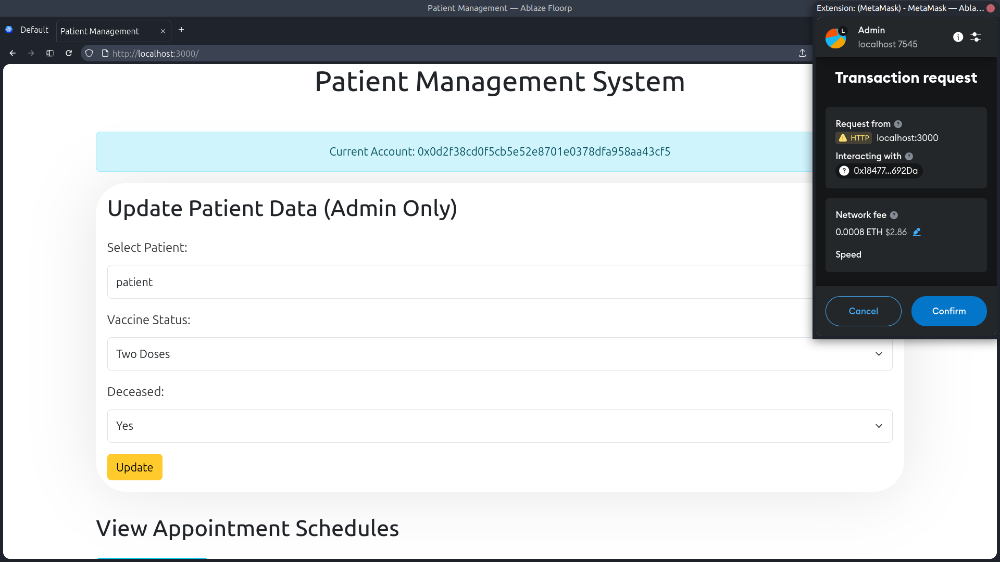
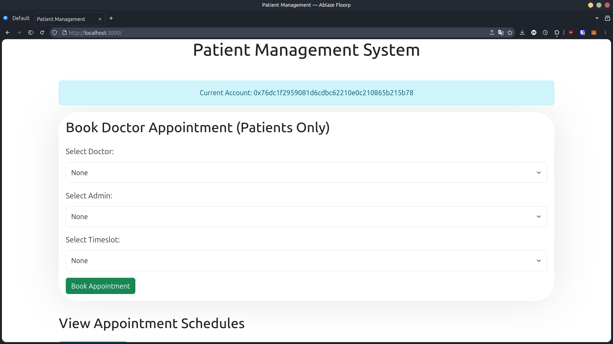
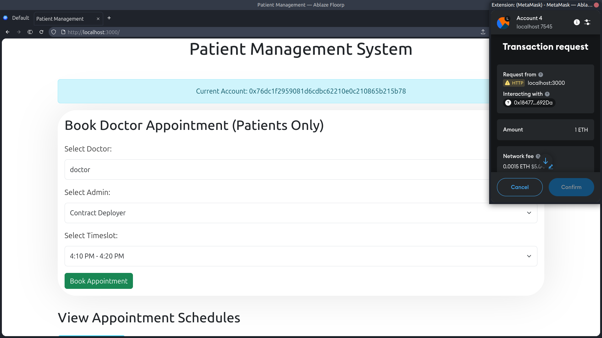
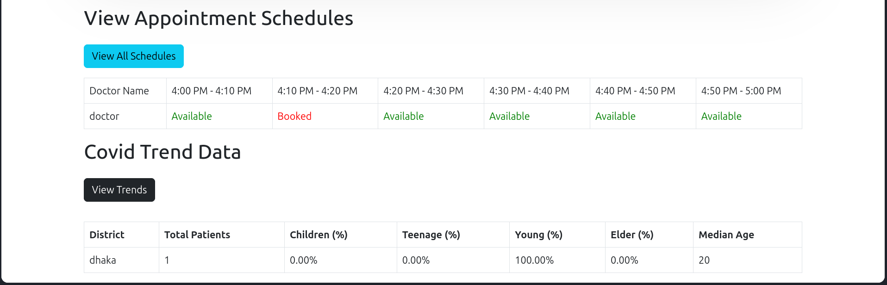

# HealthCare-dApp

A decentralized application for managing healthcare records, doctor appointments, and issuing token-based rewards. It uses smart contracts on Ethereum and a JavaScript-based backend with MongoDB for storing off-chain data.

---

## Features

- **Appointment Management**: Patients can book appointments with doctors.
- **Role-Based Access**: Roles for patients, doctors, and admins can be registered.
- **Data on Blockchain**: All data is securely stored on the Ethereum blockchain using smart contracts.
- **Off-Chain Data Storage**: Uses MongoDB to store non-sensitive data and support efficient querying.
- **View All Users**: Admins can view all registered patients and doctors through the interface.
- **Tech Stack**: Built with React.js for frontend and Solidity for smart contracts.
- **Blockchain Interaction**: Uses MetaMask for user authentication and blockchain transactions.
- **Deployment Tools**: Smart contracts deployed with Truffle; Ganache used for local Ethereum blockchain.

---

## Environment Setup
Following commands are tested on window.

### Prerequisites
1. **Install Node Version Manager (nvm):**
   ```bash
   curl -o- https://raw.githubusercontent.com/nvm-sh/nvm/v0.39.2/install.sh | bash
   ```

2. **Install Node.js (v18.15.0):**
   ```bash
   nvm install v18.20.7
   nvm alias default v18.20.7
   ```

3. **Install Truffle:**
   ```bash
   npm install -g truffle
   ```

4. **Install MongoDB**
   - Download and install MongoDB Community Edition from the official site: 
     https://www.mongodb.com/try/download/community
   - Example connection string used in this project:
     mongodb://localhost:27017/healthcare-dapp

4. **Install Ganache:**
   - Download from [Ganache](https://trufflesuite.com/ganache/)
   - Install additional tools:
     ```bash
     sudo add-apt-repository universe && sudo apt install libfuse2
     ```
   - Make the downloaded file executable and run it.

5. **Install MetaMask:**
   - Go to [MetaMask](https://metamask.io/) and install the extension for your preferred browser.
   - Follow the on-screen instructions to set up MetaMask.

### Connecting MetaMask to Ganache
1. **Add Network Manually in MetaMask:**
   - Network Name: localhost:7545
   - New RPC URL: http://127.0.0.1:7545
   - Chain ID: 1337
   - Currency Symbol: ETH

2. **Import Ganache Account to MetaMask:**
   - Copy the private key from Ganache.
   - Import the account in MetaMask using the private key.
---

## Installation
1. Clone the repository.
2. Start Ganache and create a new workspace.
3. In a **new terminal**, navigate to the backend folder and start the server:
    ```bash
    cd backend
    node server.js
    ```
4. **new terminal**, Compile and deploy the smart contracts using Truffle:
    ```bash
    truffle compile
    truffle migrate
    ```
5. Install the required packages:
    ```bash
    npm install
    ```
6. Start the React app:
    ```bash
    npm run dev
    ```
7. Open the app in your browser at `http://localhost:3000/`.
---

## Screenshots

### Registration Page (Admin & Doctor & patients)
The screenshots showcase the Home and Registration pages of the Healthcare DApp. The home page confirms successful MetaMask wallet connection and displays the user's token balance. Users can register as Admin, Doctor, or Patient by selecting their role and filling out the respective form. Each registration triggers a MetaMask transaction for secure blockchain-based storage. Admins enter their name, doctors provide additional details like specialization and license number, and patients submit information such as age, symptoms, and blood group.
![Registration Page].(

### Registration Page (Patient)
Here patients can register by providing their details. Every time you register a new patient, a new transaction is created in the blockchain.


### Admin Dashboard
Here you will be able to update patient information.


### Patient Dashboard
Here you will be able to book an appointment with a doctor. You can also view if the doctor is booked at a particular time.

Every time a patient books an appointment, the selected admin gets one ether as a fee.


### Doctor Schedule
Here the doctor can view their schedule and appointments with information like how many patients registered and their age.


---

## How to Contribute
1. Fork the repository.
2. Push your changes to a new branch.
3. Create a pull request.
4. Wait for the pull request to be reviewed.
